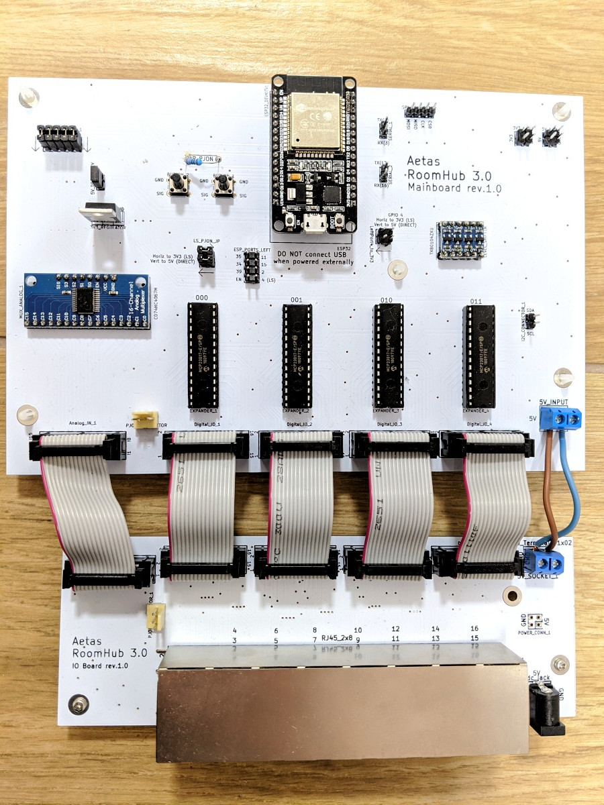
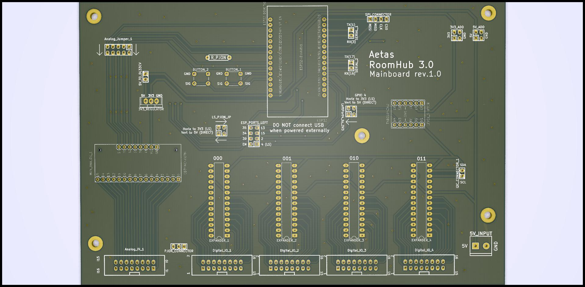
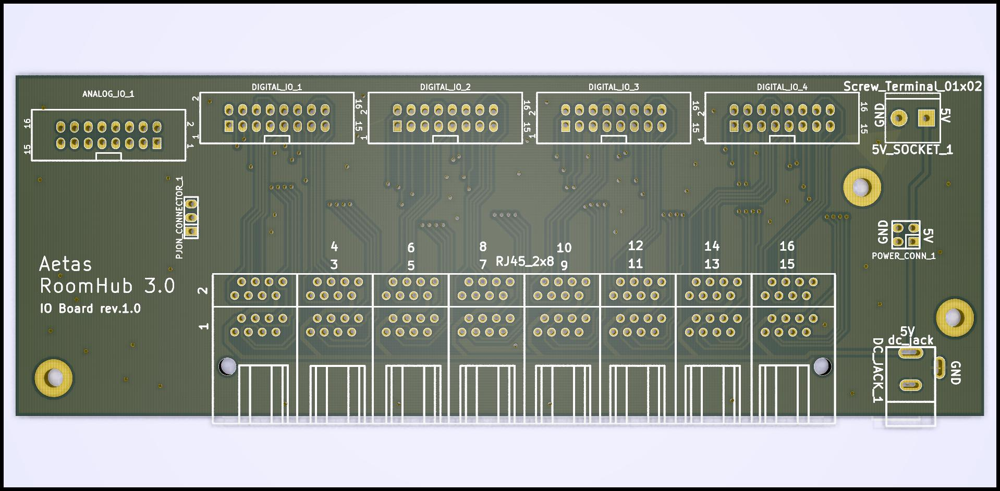

RoomHub consists of two boards:

- Mainboard
- IO Board

## Mainboard

**Mainboard** is home for the key components of the device.  
Most important element is DOIT Esp32 DevKit v1 microcontroller which controls other components and provides WiFi connection. Four 16-channel port expanders MCP23017 has been used to supply enough (64) digital input/output ports. Analog port has been expanded to provide 16 input port by 16-channel analog multiplexer.  

Digital ports and PJON (optionally) signals are going through level shifter to support communication with 5V devices (ESP32 is working with 3.3V).  
Analog input is directly connected to ESP32 ports so it should use maximum of 3.3V.

## IO Board

As a name suggest **IO Board** is responsible for input and output. This task is fulfilled by sixteen RJ45 ports. Each port provides:

- power (+5V and GND)
- 4 digital input/output wires
- 1 analog input wire
- 1 PJON wire

See [wiring](wiring.md) page to learn more about RJ45 ports and each wire role.

## Boards connection

Boards are connected with IDC16 ribbon cables for digital and analog data. PJON connection between the boards with 3-pin cable. Additionally, 5V power is forwarded from IO board to mainboard by cables connected with screw terminals.

Two boards design has been chosen to save costs on the future upgrades of the system. If there will be major upgrade of some components on the mainboard (e.g. ESP32 will be replaced by other microcontroller) it will be enough to replace mainboard to the new version and keep IO board. Similarly, in case of the IO board major change (e.g. replacing RJ45 ports with other standard), mainboard will not need to be replaced.

[TODO detailed pins usage on the board and left pins]