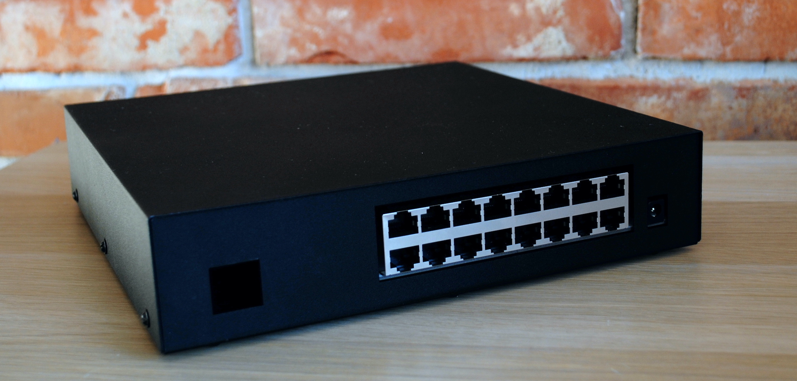
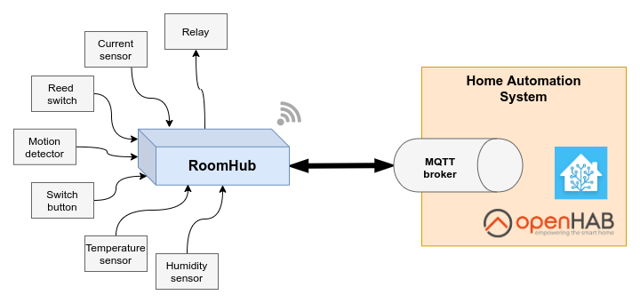

# Aetas RoomHub 3

## What is RoomHub
Aetas RoomHub is gateway device for multiple wired electronic sensors and controllers, which are essential in creating smart home solution.

RoomHub has been created to support multi-device, fully wired solution. RoomHub supports MQTT Homie convention for seamless integration with home automation software like OpenHab and Home Assistant.

Both RoomHub hardware and software are freely available under Open Source Licenses.

## What's the use case?

Typical use case for RoomHub is house with sensors and controllers distributed all around with wired connections. It is possible to plug in simple (and cheap) devices, like relay modules, PIR motion sensors or just plain wall switches into RoomHub to make fully capable home automation system.

## What's next?

- [Introduction](user-guide/introduction.md)
- [Quick start](user-guide/quick-start.md)
- [Hardware](hardware/board-layout.md)

