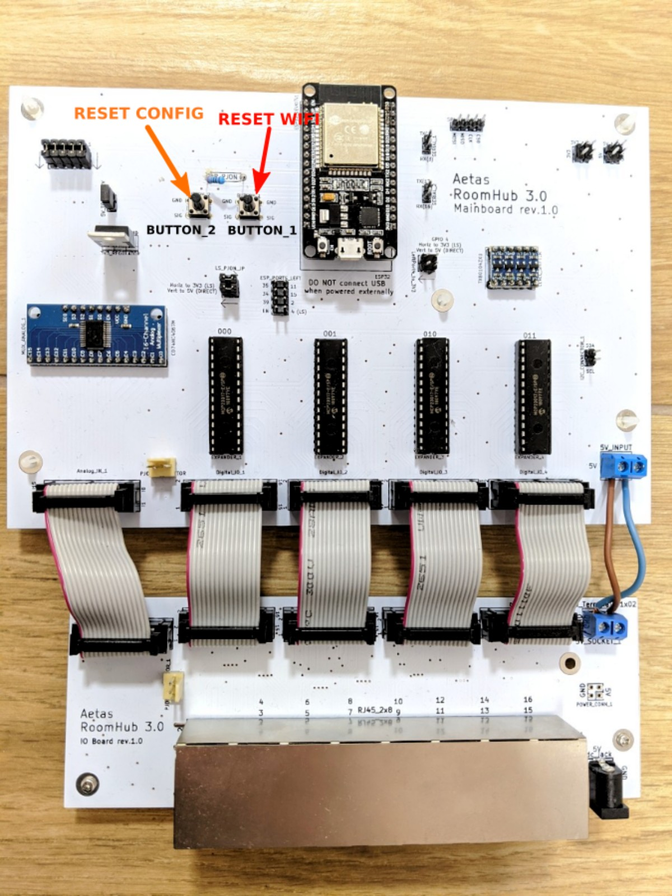
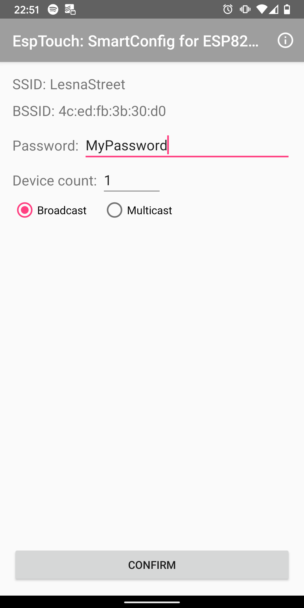
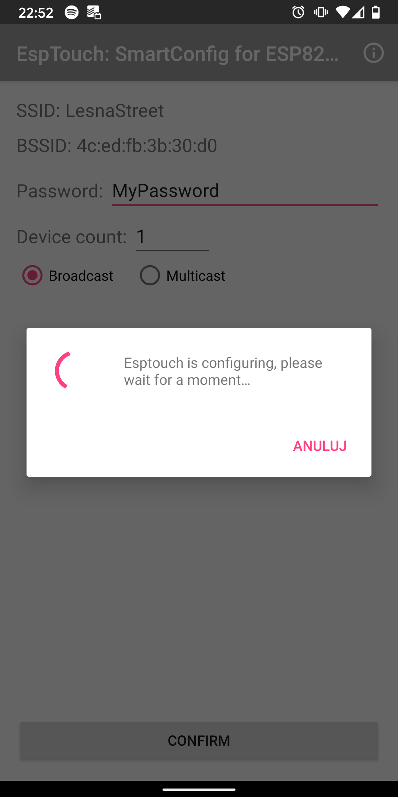
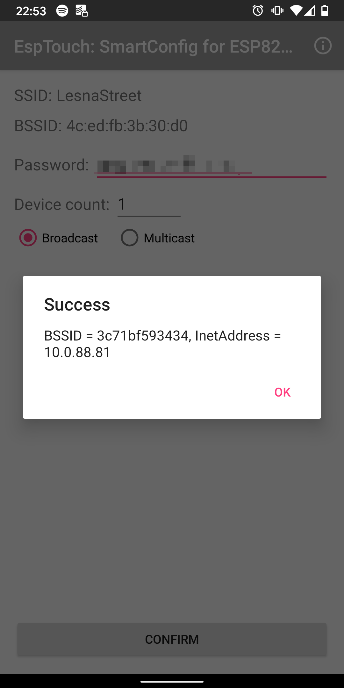
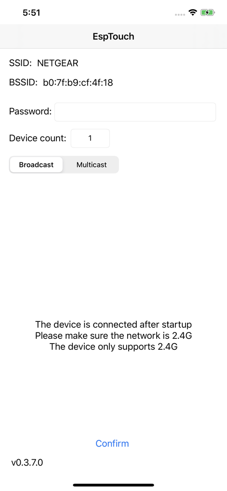
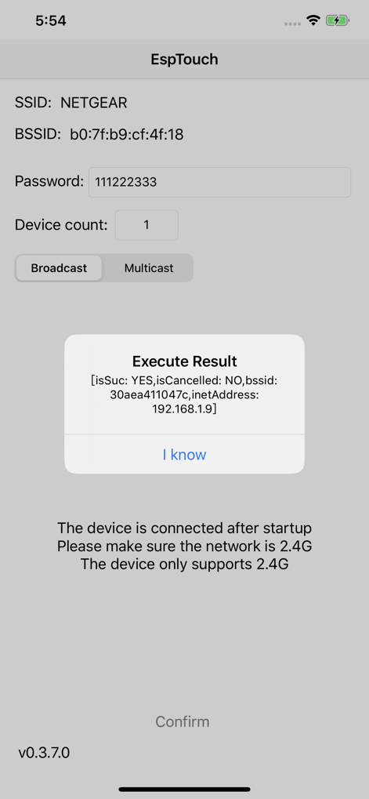

## RoomHub configurator installation

Download latest version of RoomHub Configurator for your operating system:

- [Linux](https://github.com/aetas/RoomHubConfigurator/releases/download/release-0.1.0-alpha.20/room-hub-configurator-0.1.0-alpha.20-linux.zip)
- [MacOS](https://github.com/aetas/RoomHubConfigurator/releases/download/release-0.1.0-alpha.20/room-hub-configurator-0.1.0-alpha.20-mac.zip)
- [Windows](https://github.com/aetas/RoomHubConfigurator/releases/download/release-0.1.0-alpha.20/room-hub-configurator-0.1.0-alpha.20-win.zip)

After extracting downloaded archive - executable file is located in `bin/room-hub-configurator` (for Un*x) or `bin/room-hub-configurator.bat` (for Windows).

## RoomHub configuration process

!!! info
    If you have configured your RoomHub earlier - you may want to start with [resetting devices configuration](#reset-devices-configuration) and/or [WiFi connection](#reset-wifi-configuration).


1. Make sure RoomHub has [WiFi connection configured](#wifi-configuration) or using ethernet connection with W5500. Keep in mind that different firmware needs to be used for wired connection.
2. Prepare [configuration file](#roomhub-configuration-file).
3. Run configurator to send configuration to RoomHub

    ``` tab="Linux"
    bin/room-hub-configurator your-file.roomhub.yml
    ```

    ``` tab="MacOS"
    bin/room-hub-configurator your-file.roomhub.yml
    ```

    ``` tab="Windows"
    bin/room-hub-configurator.bat your-file.roomhub.yml
    ```

4. Observe logs to check if configuration has been applied successfully.
5. RoomHub will be automatically restarted if configuration has been finished. In case of errors you can correct configuration file and run configurator again without restarting RoomHub.

You can subscribe to MQTT topic `homie/YourRoomHubName/#` to see if RoomHub has correctly started with new configuration.

[TODO: add asciinema showing configuration process]


## RoomHub configuration file

RoomHub configuration file is written in YAML format. You can use basic text editor to create this file, but if you are using more advanced editor (like [VSCode](https://code.visualstudio.com/)) then you can use [JSON schema](https://raw.githubusercontent.com/aetas/RoomHubConfigurator/master/src/main/resources/config.schema.json) for autocompletion and validation.

The structure of the file is like:

```yaml tab="your-file.roomhub.yml"
configVersion: "3.0" # version of this config file format (leave unchanged)
name: "YourRoomHubName" # name of RoomHub used in MQTT topic
destinationIpAddress: "192.168.1.66" # IP of RoomHub (e.g. from EspTouch)
mqttHostname: "192.168.1.52" ## address of MQTT server
network: # Ethernet configuration - put anything when running on WiFi
  macAddress: "6D:CB:54:AD:E9:93"
  ipAddress: "192.168.1.66"
rooms: # list of rooms
  - name: "bathroom"
    points: # list of points
      - name: "bathroom light switch box"
        portNumber: 1
        devices: # list of devices
          - name: "bathroom light" # name of device
            id: 1 # identifier of device (unique in this configuration file)
            wires: ["BLUE"] # list of ethernet wires used for connection
            type: RELAY # type of device
          - name: "bathroom light switch"
            id: 2
            wires: ["BLUE_WHITE"]
            type: SWITCH_BUTTON
            config: # some devices has additional config options
              debounceMs: 50
```


See [naming convention page](naming-convention.md) to find explanation of terms like "point".


## Reset devices configuration
To reset configuration (device name, MQTT hostname and devices) keep button 2 (on Mainboard) pressed for 5 seconds when restarting RoomHub. 

1. Make sure RoomHub is connected to power socket
2. Keep button 2 pressed on mainboard (see image below)
3. Reset RoomHub by shortly pressing EN button on ESP32
4. Release button 2 when blue LED will start blinking on ESP32

ESP32 will indicate configuration reset by blinking 3 times with blue LED.

After configuration reset, RoomHub will restart and start server waiting for new configuration.


[{: style="width:60%; display: block; margin: 0 auto;"}](images/RoomHub-board-ResetButtons.jpg)

## WiFi configuration

WiFi configuration is done with [ESP Touch Smart Config](https://www.espressif.com/en/products/software/esp-touch/overview) 

You need Android or iOS smartphone to configure WiFi on RoomHub.
First reset existing RoomHub WiFi configuration and then configure it with app on your mobile.

### Reset WiFi configuration
To reset WiFi setup, keep button 1 on mainboard pressed for 5 seconds when restarting RoomHub. 

1. Make sure RoomHub is connected to power socket
2. Keep button 1 pressed on mainboard ([see image](images/RoomHub-board-ResetButtons.jpg))
3. Reset RoomHub by pushing "EN" button on ESP32 for a moment
4. Release button 1 when blue LED will start blinking on ESP32


ESP32 will indicate WiFi configuration reset by blinking 5 times with blue LED.

After WiFi configuration reset, RoomHub will restart and start in ESP Smart Config WiFi mode.

### Android

1. Install [EspTouch](https://play.google.com/store/apps/details?id=com.khoazero123.iot_esptouch_demo) from Google Play.
2. Connect your phone to WiFi network you want RoomHub to be connected to
3. Open EspTouch and insert password
4. Press "confirm"
5. After around 30 seconds you should get success message with IP address of RoomHub - store this IP address for later

[{: style="width:32%"}](images/ESPTouch_Android_1.png)
[{: style="width:32%"}](images/ESPTouch_Android_2.png)
[{: style="width:32%"}](images/ESPTouch_Android_3.png)

### iPhone (iOS)

1. Install [Espressif Esptouch](https://apps.apple.com/us/app/espressif-esptouch/id1071176700) from App Store.
2. Connect your phone to WiFi network you want RoomHub to be connected to
3. Open EspTouch and insert password
4. Press "confirm"
5. After around 30 seconds you should get success message with IP address of RoomHub - store this IP address for later

[{: style="width:35%"}](images/ESPTouch_iOS_1.png)
[{: style="width:35%"}](images/ESPTouch_iOS_2.png)


