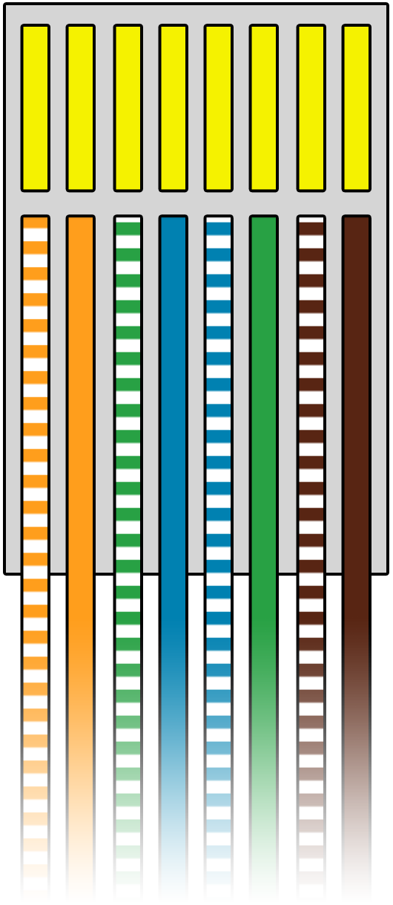

!!! info
    This quick start guide assumes you have RoomHub hardware ready. If you are looking for how to prepare the hardware - look into [hardware section](../hardware/board-layout.md).


Quick start guide shows how to connect relay module and configure RoomHub to control it. Connecting other types of devices is similar and can be done with the similar steps.  


## What do you need
- Assembled Aetas RoomHub 3
- [PlatformIO](https://platformio.org/) installed (if your RoomHub doesn't have firmware installed)
- WiFi network
- Mobile phone (Android or iOS)
- Running MQTT broker (e.g. [Mosquitto](https://mosquitto.org/))
- MQTT client installed on your computer (e.g. [MQTT.js](https://github.com/mqttjs/MQTT.js#readme))
- UTP cable
- relay module


## Connect and configure device

!!! warning 
    Make sure RoomHub is never connected to power supply and USB port at the same time. This will destroy the device and may damage your computer.

1. Install RoomHub firmware (see [instruction](https://github.com/aetas/roomhub#installation))
2. Connect RoomHub to power supply (make sure it is not connected to USB)
3. Keep button 1 pressed on RoomHub and restart it by pressing "EN" button on ESP32 (keep button 1 pressed until blue LED will blink 3 times - around 5 seconds) [TODO: add link to RoomHub schema with button 1 shown]
4. Use EspTouch to connect RoomHub to your WiFi network ([Google Play](https://play.google.com/store/apps/details?id=com.khoazero123.iot_esptouch_demo) or [Apple Store](https://apps.apple.com/us/app/espressif-esptouch/id1071176700)) - [more](../user-guide/configuration.md#wifi-configuration)
    1. Connect your phone to the WiFi network you want RoomHub to be connected to
    2. Put your WiFi password in the application 
    3. Press "Confirm" in the app
    4. After around 30 seconds you should get success message with IP address of RoomHub - store this IP address for later

5. Prepare UTP cable with plug on one side (according to standard T568B)
[{: style="height:150px; display: block; margin: 0 auto;transform: rotate(90deg)"}](images/T568B.png)

6. Connect module to UTP cable
    - VCC (orange wire)
    - ground (orange-white wire)
    - control (blue wire)
    - [TODO: photo with module connected to wires]

7. Connect module to RoomHub port 1
    - [TODO: photo with cable plugged into port 1]
8. Prepare configuration file in YAML - look into comments to find out which value to change<br>
```yaml
configVersion: "3.0"
name: "TestRoomHub"
destinationIpAddress: "192.168.1.66" # set IP of RoomHub (see point 4.d.)
mqttHostname: "192.168.1.52" # set IP of your MQTT broker
network: # only for Ethernet - leave as it is for WiFi connection
  macAddress: "6D:CB:54:AD:E9:93"
  ipAddress: "0.0.0.0"
rooms:
  - name: "workshop"
    points:
      - name: "point with test relay"
        portNumber: 1
        devices:
          - name: "test relay"
            id: 1
            wires: ["BLUE"]
            type: RELAY
```
<br>
For more details on configuration files see [configuration page](configuration.md#roomhub-configuration-file).

9. Apply configuration with configurator
    - Download latest version of RoomHub Configurator for [Linux](https://github.com/aetas/RoomHubConfigurator/releases/download/release-0.1.0-alpha.20/room-hub-configurator-0.1.0-alpha.20-linux.zip), [MacOS](https://github.com/aetas/RoomHubConfigurator/releases/download/release-0.1.0-alpha.20/room-hub-configurator-0.1.0-alpha.20-mac.zip) or [Windows](https://github.com/aetas/RoomHubConfigurator/releases/download/release-0.1.0-alpha.20/room-hub-configurator-0.1.0-alpha.20-win.zip)
    - Extract archive
    - Run Configurator CLI with command 
       
        ```bash tab="Linux"
        bin/room-hub-configurator your-file.roomhub.yml
        ```

        ```bash tab="MacOS"
        bin/room-hub-configurator your-file.roomhub.yml
        ```

        ```bash tab="Windows"
        bin/room-hub-configurator.bat your-file.roomhub.yml
        ```

10. Subscribe to MQTT topic to see device has been initialized (replace IP address with your MQTT broker address)
  ```bash
  mqtt sub -t 'homie/TestRoomHub/#' -h '192.168.1.52' -v
  ```
  <details>
    <summary>Sample output</summary>
    [TODO: add proper output after subscribing]
  </details>

11. Send MQTT message to switch relay state (replace IP address with your MQTT broker address)
  ```bash
  mqtt pub -t 'homie/TestRoomHub/1/state/set' -h '192.168.1.52' -m 'ON'
  ```

Congratulation! You have just configured your first device on RoomHub.


## What's next?

- [Read full user guide starting with naming conventions](../naming-convention)
- [Find out all supported devices](../supported-devices)

  
[TODO: go through points with device and check that everything is described - ask Piotr or Ania to do that]
